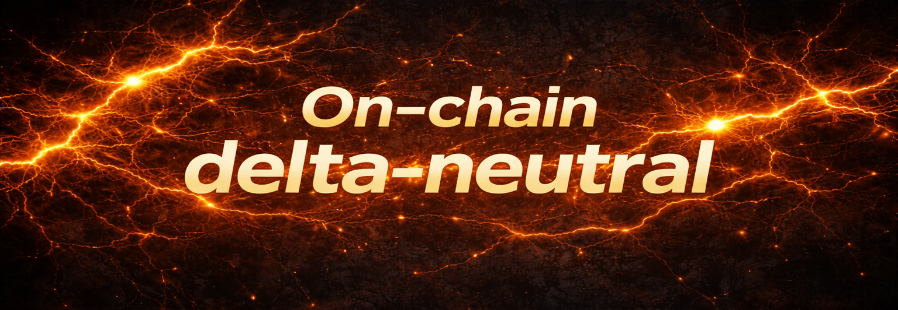

  

---

# OK-BITOK

Structured DeFi Infrastructure

OK-BITOK is a DeFi infrastructure platform building structured delta-neutral vault strategies focused on funding and basis markets.

The protocol combines on-chain capital accounting with a professional off-chain execution stack to capture structural funding flows while maintaining controlled market exposure.

---

## Quick Links

Website: https://ok-bitok.com  
Docs: https://docs.ok-bitok.com  
Contract (Arbitrum): https://arbiscan.io/address/0xD772A28caf98cCF3c774c704cA9514A4914b50A0  

---

## Architecture

  

---

## Core Principles

- Delta-neutral positioning  
- Transparent on-chain share accounting  
- Structured risk management  
- Professional execution infrastructure  
- Capital discipline over speculation  

---

## Public Components

The following components are publicly accessible:

- Vault smart contract  
- Protocol specification  
- On-chain accounting logic  
- Deployment addresses  

---

## Private Infrastructure

Execution infrastructure is intentionally private and includes:

- Trading engine  
- Exchange connectivity layer  
- Risk control systems  
- Position management logic  
- Monitoring and automation stack  

This separation protects operational integrity and investor capital.

---

## Contact

contact@ok-bitok.com
